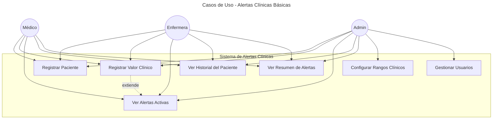
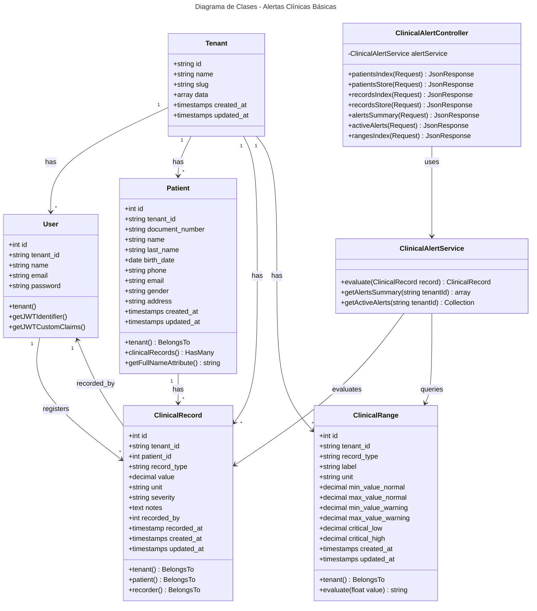
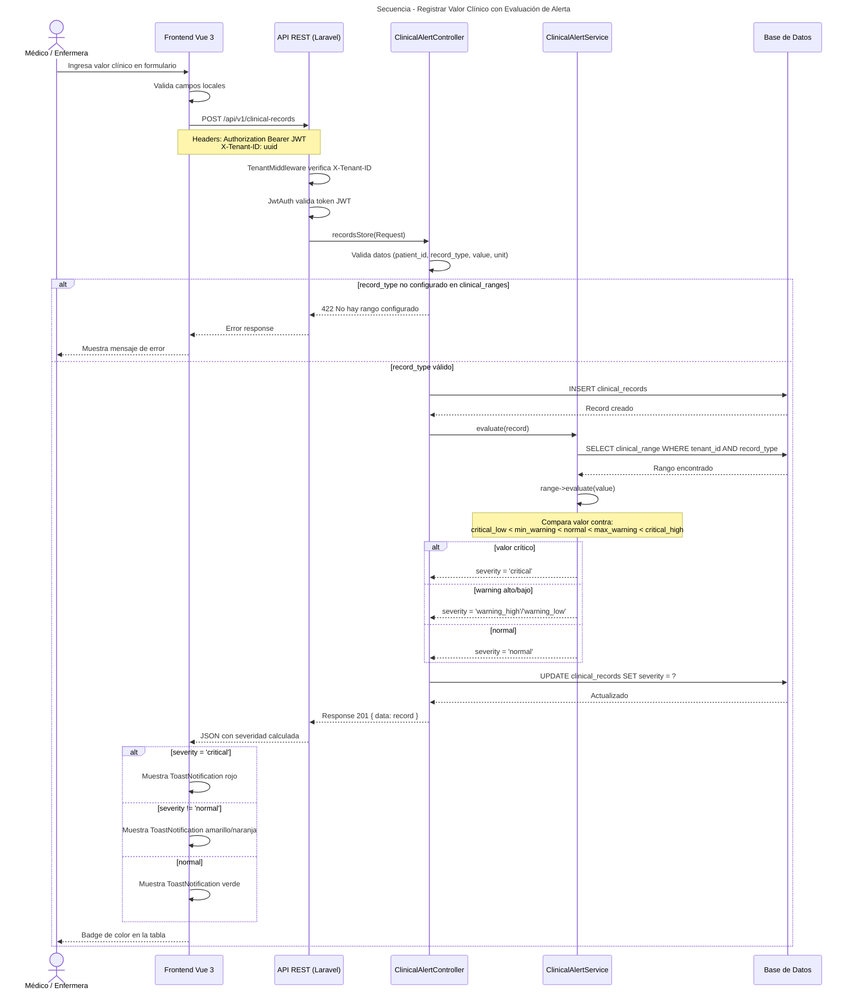

# Diagramas UML — Módulo Alertas Clínicas Básicas

---

## 1. Diagrama de Casos de Uso

---

## 2. Diagrama de Clases

---

## 3. Diagrama de Secuencia

### Flujo: "Registrar valor clínico y recibir alerta"

